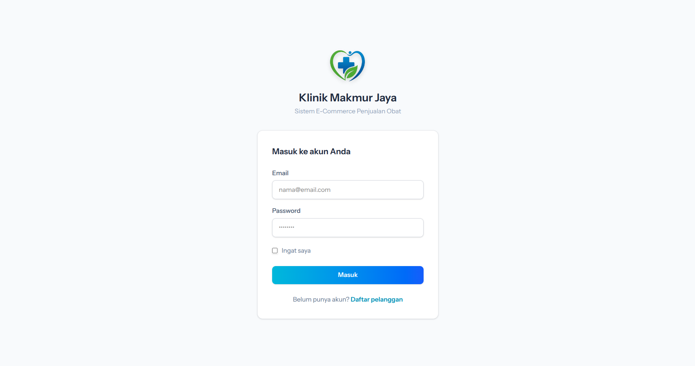
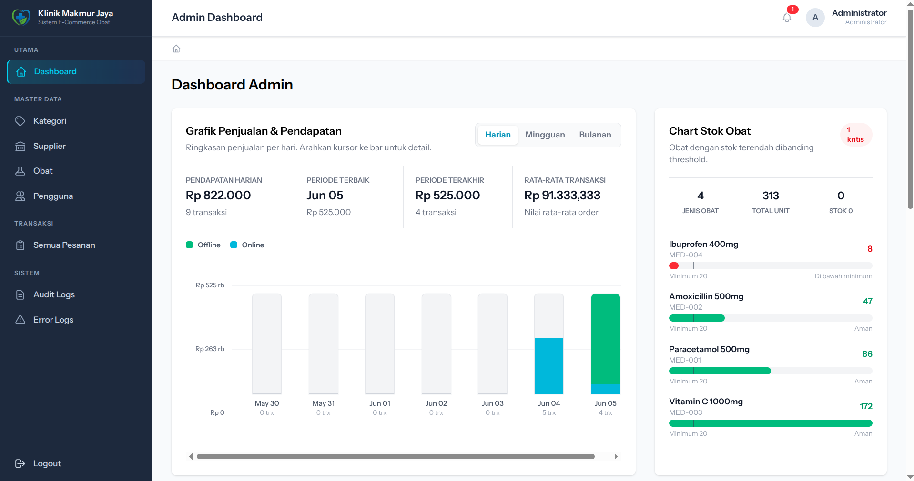
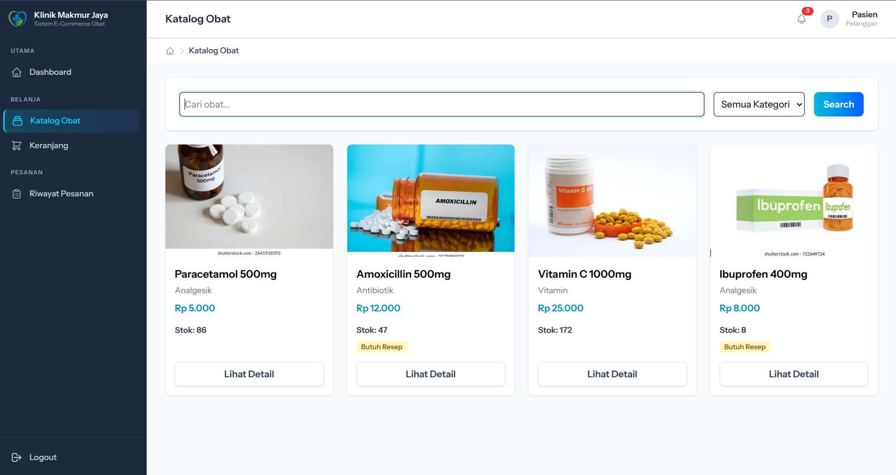
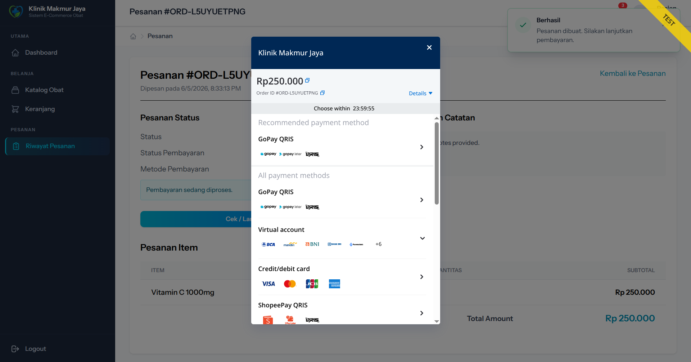
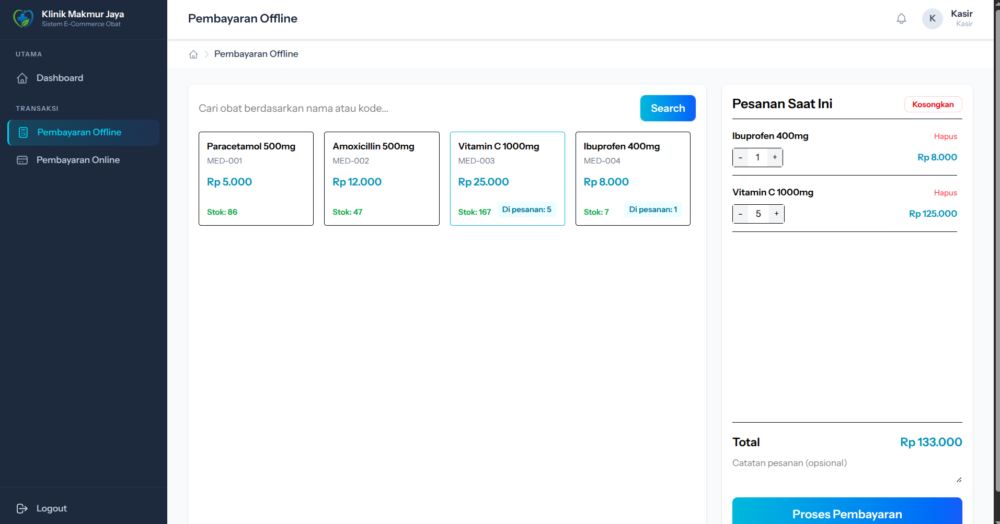
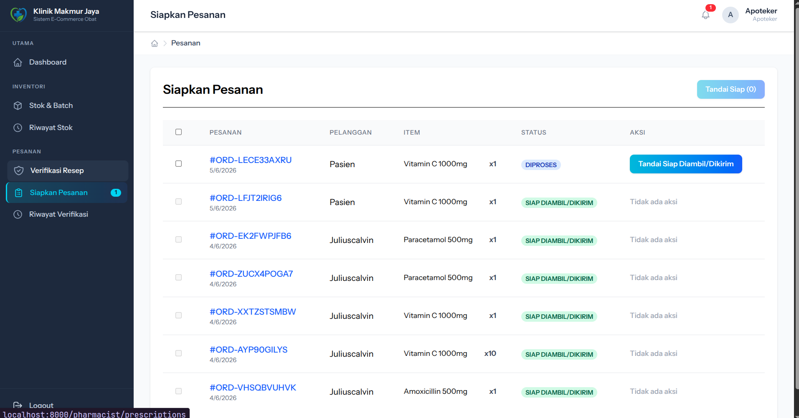

<div align="center">
    
    <h1>Klinik Makmur Jaya</h1>
    <p>Sistem E-Commerce & Manajemen Apotek berbasis web untuk operasional klinik dan apotek.</p>
    <p>
        
        
        
        
        
        
        
        
    </p>
    <blockquote>
        Dikembangkan untuk memenuhi kebutuhan sistem e-commerce obat, manajemen stok, pembayaran, resep, notifikasi, dan laporan klinik.
    </blockquote>
    <p>
        <a href="docs/01-dokumen-perencanaan-proyek-klinik-makmur-jaya.md">Dokumen Perencanaan Proyek (MD)</a><br>
        <a href="docs/02-dokumen-analisis-perancangan-dan-desain-teknis-sistem-klinik-makmur-jaya.md">Dokumen Analisis, Perancangan, dan Desain Teknis Sistem (MD)</a><br>
        <a href="docs/03-dokumen-migrasi-cutover-dan-perubahan-klinik-makmur-jaya.md">Dokumen Migrasi, Cutover, dan Perubahan (MD)</a><br>
        <a href="docs/04-dokumen-pengujian-sistem-klinik-makmur-jaya">Dokumen Pengujian (MD)</a><br>
        <a href="docs/05-dokumen-panduan-pengguna-klinik-makmur-jaya.md">Dokumen Panduan Pengguna (MD)</a><br>
        <a href="docs/security-risk-analysis.md">Analisis Risiko Keamanan Informasi (MD)</a>
    </p>
    <table>
        <tr>
            <td></td>
            <td></td>
        </tr>
        <tr>
            <td></td>
            <td></td>
        </tr>
        <tr>
            <td></td>
            <td></td>
        </tr>
    </table>
</div>

## Architecture Overview

Aplikasi ini dibangun dengan arsitektur monolith Laravel + React menggunakan Inertia.js sebagai bridge antara backend dan frontend.

## Ringkasan Teknologi

| Area | Teknologi | Keterangan |
| --- | --- | --- |
| Backend | Laravel | Routing, controller, service layer, queue, notification, validation, middleware keamanan |
| Frontend | React | Halaman admin, apoteker, kasir, dan pelanggan berbasis komponen |
| Bridge | Inertia.js | Menghubungkan Laravel controller dengan React page tanpa REST API terpisah |
| Styling | Tailwind CSS v4 | Styling antarmuka, dashboard, tabel, card, badge, toast, dan modal |
| Database | MySQL | Penyimpanan user, role, obat, batch, stok, pesanan, audit log, error log, report job |
| Queue | Laravel Database Queue | Background export Excel/PDF, import CSV/Excel, cek stok, kadaluarsa, dan webhook payment |
| Payment Gateway | Midtrans Snap + Webhook | Pembayaran online, validasi signature, sinkronisasi status transaksi |
| Export Report | Maatwebsite Excel + DomPDF | Export laporan penjualan Excel/PDF dengan progress background |
| File Storage | Laravel Storage | Upload gambar obat, resep pelanggan, hasil report background |
| Authentication | Laravel Auth + Spatie Permission | Login multi-role: Admin, Apoteker, Kasir, Pasien |
| Notification | Laravel Notification | In-app notification, email opsional, badge, polling fallback |
| Security | CSRF, CSP, Session, Audit Log | Proteksi request, session timeout, security headers, audit/error log |

*Untuk melihat pedoman dan arsitektur lengkap sistem, silakan baca [Architecture.md](Architecture.md).*

## Prasyarat

Pastikan spesifikasi minimum berikut sudah terpasang di sistem Anda sebelum memulai:
- PHP >= 8.2
- Composer
- Node.js (>= v20) & npm
- MySQL Server

## Panduan Instalasi (Development Script)

Ikuti instruksi di bawah ini secara berurutan untuk menjalankan aplikasi di *local environment*:

1. **Clone & Masuk ke Direktori Proyek**
   ```bash
   git clone <repo-url>
   cd klinik-makmur-jaya
   ```

2. **Instal Dependensi Backend (Laravel)**
   ```bash
   composer install
   ```

3. **Instal Dependensi Frontend (React)**
   ```bash
   npm install
   ```

4. **Konfigurasi Environment**
   Salin contoh konfigurasi ke file `.env`.
   ```bash
   cp .env.example .env
   ```
   Atur kredensial database MySQL Anda di `.env` (`DB_DATABASE`, `DB_USERNAME`, `DB_PASSWORD`) dan kunci Midtrans jika diperlukan.

5. **Generate Application Key**
   ```bash
   php artisan key:generate
   ```

6. **Migrasi dan Seed Database**
   Langkah ini akan membuat tabel di database dan mengisi data awal (dummy data) beserta peran (roles) pengguna.
   ```bash
   php artisan migrate --seed
   ```

7. **Storage Link**
   Agar file unggahan seperti resep pasien atau bukti laporan PDF dapat diakses secara publik.
   ```bash
   php artisan storage:link
   ```

## Akun Demo

Gunakan akun berikut setelah menjalankan `php artisan migrate --seed`.

| Role | Email | Password | Akses Utama |
| --- | --- | --- | --- |
| Admin | `admin@klinik.test` | `password` | Dashboard admin, master data, semua pesanan, audit log, error log, export laporan |
| Apoteker | `apoteker@klinik.test` | `password` | Stok & batch, riwayat stok, verifikasi resep, siapkan pesanan |
| Kasir | `kasir@klinik.test` | `password` | Dashboard kasir dan pembayaran offline/POS |
| Pasien | `pasien@klinik.test` | `password` | Katalog obat, keranjang, checkout, pembayaran online, riwayat pesanan |

## Menjalankan Aplikasi

Anda akan memerlukan setidaknya **dua terminal** untuk menjalankan aplikasi sepenuhnya. Terminal ketiga sangat disarankan untuk menjalankan proses *background/queue*.

**Terminal 1: Menjalankan Backend Laravel**
```bash
php artisan serve
```
*(Server PHP secara default akan berjalan di `http://localhost:8000`)*

**Terminal 2: Menjalankan Frontend Vite Server**
```bash
npm run dev
```
*(Ini akan me-render perubahan komponen React & Tailwind secara realtime di browser)*

**Terminal 3: Menjalankan Queue Worker (Untuk Background Jobs)**
```bash
php artisan queue:work
```
*(Penting agar ekspor laporan PDF/Excel, impor CSV, dan pemrosesan dari webhook Midtrans berjalan)*

Aplikasi siap diakses di [http://localhost:8000](http://localhost:8000).
